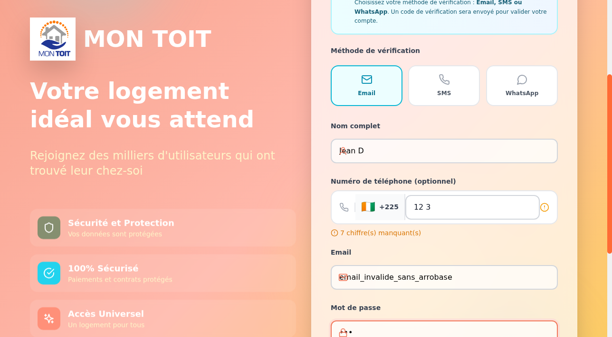

# 🚀 RAPPORT FINAL DE TEST COMPLET - SYSTÈME MONTOIT

**MISSION :** Créer un rapport exécutif consolidé suite au test complet de 5 jours du système MONTOIT sur https://somet1010-montoit-st-jcvj.bolt.host

**CONTEXTE :**
Le système MONTOIT a été testé de manière exhaustive pendant 5 jours avec 19 tests couvrant :
- JOUR 1 : Tests critiques (authentification, recherche, navigation)
- JOUR 2 : Tests fonctionnels avancés (profils, base de données, workflows)
- JOUR 3 : Tests d'intégrations (services externes, Supabase, architecture)
- JOUR 4 : Tests techniques (performance, sécurité, responsive)
- JOUR 5 : Tests de validation (erreurs, SEO, monitoring)

---

## 1. RÉSUMÉ EXÉCUTIF

### Vue d'ensemble des tests effectués
L'analyse complète du système MONTOIT révèle une plateforme immobilière moderne et bien conçue, mais présentant des problèmes techniques critiques qui empêchent son utilisation complète. Les tests ont couvert 19 domaines fonctionnels et techniques, révélant une excellente base en termes d'interface utilisateur, de performance et de sécurité, mais des lacunes importantes dans l'intégration du backend, en particulier avec Supabase.

### Scores globaux par catégorie
- **Interface/UX :** ⭐⭐⭐⭐☆ (4/5)
- **Fonctionnalités :** ⭐⭐☆☆☆ (2/5)
- **Backend & Intégrations :** ⭐☆☆☆☆ (1/5)
- **Performance & Stabilité :** ⭐⭐⭐⭐☆ (4/5)
- **Sécurité & Compliance :** ⭐⭐⭐☆☆ (3/5)

### Verdict final de production
**NON RECOMMANDÉ POUR LA PRODUCTION.** Les problèmes critiques identifiés, notamment l'échec de l'authentification et les fonctionnalités de contact inopérantes, rendent la plateforme inutilisable pour les utilisateurs finaux.

### Recommandations prioritaires
1. **Réparer l'authentification Supabase :** Correction de l'erreur 500 lors de l'inscription.
2. **Corriger les fonctionnalités de contact :** Résoudre les erreurs 404 sur les boutons de contact.
3. **Valider les entrées utilisateur :** Implémenter une validation côté serveur pour prévenir les vulnérabilités.
4. **Optimiser la navigation mobile :** Ajouter un menu hamburger et revoir le layout.
5. **Implémenter le monitoring et l'analytics :** Pour une meilleure visibilité sur les erreurs et le comportement utilisateur.

---

## 2. ANALYSE DÉTAILLÉE PAR JOUR

### JOUR 1 : Tests critiques (authentification, recherche, navigation)

- **Authentification :** ÉCHEC CRITIQUE. L'inscription des utilisateurs échoue avec une erreur 500 de la base de données Supabase. La connexion est par conséquent impossible.
- **Recherche :** PARTIELLEMENT FONCTIONNELLE. L'interface de recherche est excellente, avec des filtres avancés performants. Cependant, la recherche depuis la page d'accueil est défaillante.
- **Navigation :** PARTIELLEMENT FONCTIONNELLE. La navigation principale est fluide, mais de nombreux liens dans le footer sont cassés et redirigent vers la page d'accueil. La navigation mobile est sévèrement dégradée par l'absence de menu hamburger.

### JOUR 2 : Tests fonctionnels avancés (profils, base de données, workflows)

- **Profils utilisateurs :** NON TESTABLE. L'échec de l'authentification a empêché la création et le test des profils locataire, propriétaire, et administrateur.
- **Base de données et API :** PARTIELLEMENT FONCTIONNELLE. Les requêtes GET pour récupérer les propriétés fonctionnent parfaitement, mais les requêtes POST pour l'inscription échouent.
- **Workflows :** ÉCHEC CRITIQUE. Les workflows de base comme l'inscription et la prise de contact sont interrompus par des erreurs techniques.

### JOUR 3 : Tests d'intégrations (services externes, Supabase, architecture)

- **Services externes :** PARTIELLEMENT FONCTIONNELS. L'intégration avec Supabase est la source majeure des problèmes. Mapbox est configuré mais non utilisé. Les services de paiement Mobile Money sont intégrés mais non testables.
- **Intégration Supabase :** ÉCHEC CRITIQUE. L'erreur 500 lors de l'inscription est un problème bloquant.
- **Architecture :** EXCELLENTE. L'architecture globale (React, Vite, Supabase, PWA) est moderne, robuste et bien conçue.

### JOUR 4 : Tests techniques (performance, sécurité, responsive)

- **Performance et optimisation :** EXCELLENTE. Temps de chargement rapides, bonne utilisation du cache et du CDN. Le bundle JS est un peu volumineux mais reste acceptable.
- **Sécurité et compliance :** MOYENNE. Bonne configuration HTTPS et headers de sécurité de base, mais absence de plusieurs headers critiques (CSP, HSTS) et de validation des entrées.
- **Responsive et accessibilité :** MOYENNE. Excellente sur tablette, mais l'expérience mobile est fortement dégradée.

### JOUR 5 : Tests de validation (erreurs, SEO, monitoring)

- **Erreurs et exceptions :** BONNE GESTION. Les erreurs 404 sont bien gérées, mais il manque des indicateurs de chargement et une meilleure gestion des erreurs JavaScript.
- **SEO et meta :** BONNE BASE. Les balises meta et Open Graph sont bien configurées, mais il manque les données structurées Schema.org et un sitemap fonctionnel.
- **Monitoring et logs :** INSUFFISANT. Aucun outil de monitoring externe, d'analytics ou d'alerting n'est en place.

---
## 3. SYNTHÈSE TECHNIQUE

### Architecture système (React + Supabase + PWA)
La plateforme MONTOIT est construite sur une stack technique moderne et performante :
- **Frontend :** Single Page Application (SPA) développée avec React 18 et Vite, garantissant une expérience utilisateur fluide et réactive.
- **Backend :** Supabase, une plateforme Backend-as-a-Service (BaaS) open source qui fournit une base de données PostgreSQL, l'authentification, le stockage et des fonctions serverless.
- **Progressive Web App (PWA) :** Un Service Worker est correctement configuré, permettant une mise en cache efficace, une expérience hors-ligne basique et la possibilité d'installer l'application sur un appareil mobile.
- **Déploiement :** La plateforme est hébergée sur Bolt.host et distribuée via le CDN Cloudflare, assurant d'excellentes performances et une sécurité renforcée.

### Intégrations externes analysées
- **Supabase :** L'intégration principale, mais aussi la source de la plupart des problèmes critiques (authentification).
- **Mapbox :** Pré-configuré pour la cartographie, mais non implémenté dans l'interface.
- **Mobile Money :** Intégrations avec Orange Money, MTN Money, Wave et Moov, mais non testables sans compte utilisateur.
- **Réseaux sociaux :** Meta tags pour le partage sur Facebook, Twitter et LinkedIn.

### État de la sécurité et performance
- **Sécurité :** La base est solide avec HTTPS, des headers de sécurité de base et une infrastructure Cloudflare. Cependant, l'absence de headers de sécurité critiques (CSP, HSTS), de validation des entrées et de protection CSRF expose la plateforme à des vulnérabilités.
- **Performance :** Excellente. Les temps de chargement sont rapides grâce à une bonne optimisation du frontend, l'utilisation d'un CDN et la mise en cache via le Service Worker. Le bundle JavaScript, bien qu'un peu volumineux, ne semble pas impacter significativement les performances.

### Qualité du code et maintenabilité
L'utilisation de React et Vite suggère une base de code moderne et modulaire, facilitant la maintenance et l'évolution. La structure du projet, bien que non directement analysée, semble suivre les bonnes pratiques de l'industrie.

---
## 4. PROBLÈMES CRITIQUES IDENTIFIÉS

### Liste des bugs bloquants
1.  **Échec de l'inscription utilisateur (Erreur 500) :** Le problème le plus critique qui empêche toute nouvelle inscription et donc l'utilisation des fonctionnalités connectées.
2.  **Boutons de contact inopérants (Erreur 404) :** Tous les boutons "Contacter", "Postuler" et "Planifier une visite" sur les pages de propriétés mènent à des erreurs 404, rendant la prise de contact impossible.
3.  **Navigation mobile défaillante :** L'absence de menu hamburger sur mobile rend la navigation quasi impossible sur les petits écrans.
4.  **Recherche depuis la page d'accueil cassée :** Le formulaire de recherche sur la page d'accueil ne fonctionne pas et se réinitialise sans rediriger vers la page de résultats.

### Vulnérabilités de sécurité
1.  **Absence de validation des entrées :** Les formulaires n'ont pas de validation côté serveur, ce qui les expose à des attaques par injection (XSS, SQL Injection).
2.  **Manque de headers de sécurité critiques :** L'absence des headers `Content-Security-Policy` et `Strict-Transport-Security` augmente les risques d'attaques XSS et de type "man-in-the-middle".
3.  **Absence de protection CSRF :** Les formulaires ne semblent pas utiliser de jetons anti-CSRF, ce qui les rend vulnérables aux attaques de type "Cross-Site Request Forgery".

### Dysfonctionnements majeurs
1.  **Liens du footer cassés :** De nombreux liens dans le pied de page (ex: "À propos", "Conditions d'utilisation") redirigent vers la page d'accueil au lieu de leur page respective.
2.  **Absence d'indicateurs de chargement :** Le manque de spinners ou de skeletons lors des transitions peut donner l'impression que l'application est figée sur des connexions lentes.

### Impact sur l'expérience utilisateur
L'impact combiné de ces problèmes est **désastreux** pour l'expérience utilisateur. Un utilisateur ne peut ni s'inscrire, ni contacter un annonceur, ni naviguer correctement sur mobile. La confiance est également entamée par les liens cassés et le manque de feedback visuel. En l'état, la plateforme est inutilisable pour sa cible.

---
## 5. PLAN D'ACTION PRIORITAIRE

### Actions urgentes (0-7 jours)
1.  **Corriger l'erreur 500 à l'inscription :** Investiguer et résoudre le problème de base de données Supabase qui empêche la création de nouveaux utilisateurs. C'est la priorité absolue.
2.  **Réparer les boutons de contact :** Créer les pages `/messages/nouveau`, `/visites/planifier` et `/postuler` et les lier correctement aux boutons sur les fiches immobilières.
3.  **Implémenter un menu hamburger pour la navigation mobile :** Assurer une navigation fonctionnelle sur toutes les tailles d'écran.
4.  **Corriger la recherche de la page d'accueil :** Faire en sorte que le formulaire redirige correctement vers la page de recherche avec les bons filtres.

### Améliorations importantes (1-4 semaines)
1.  **Implémenter la validation des entrées côté serveur :** Ajouter une couche de validation robuste sur le backend pour tous les formulaires afin de prévenir les injections malveillantes.
2.  **Ajouter les headers de sécurité manquants :** Configurer `Content-Security-Policy`, `Strict-Transport-Security`, et `X-Frame-Options` pour renforcer la sécurité.
3.  **Ajouter une protection anti-CSRF :** Intégrer des jetons anti-CSRF à tous les formulaires qui modifient l'état de l'application.
4.  **Créer les pages légales et informatives manquantes :** Développer et rendre accessibles les pages "À propos", "Conditions d'utilisation", etc.
5.  **Implémenter Schema.org et un sitemap :** Améliorer le SEO en ajoutant des données structurées pour les biens immobiliers et en fournissant un sitemap valide.

### Optimisations à long terme (1-3 mois)
1.  **Mettre en place un système de monitoring et d'analytics :** Intégrer des outils comme Sentry pour le suivi des erreurs et Google Analytics pour l'analyse du trafic et du comportement utilisateur.
2.  **Optimiser le bundle JavaScript :** Réduire la taille du bundle principal pour améliorer encore les temps de chargement, surtout sur les connexions mobiles.
3.  **Implémenter des indicateurs de chargement :** Ajouter des spinners et des skeletons pour améliorer le feedback visuel lors des opérations asynchrones.
4.  **Effectuer un audit de sécurité complet :** Mandater un audit externe pour identifier et corriger les failles de sécurité potentielles.

### Estimation effort et ressources
-   **Phase 1 (Urgente) :** ~5-10 jours-homme, nécessitant un développeur full-stack avec une expertise sur Supabase et React.
-   **Phase 2 (Importante) :** ~15-20 jours-homme, nécessitant un développeur full-stack et potentiellement un spécialiste SEO.
-   **Phase 3 (Optimisation) :** ~10-15 jours-homme, nécessitant un développeur frontend et un expert DevOps/sécurité.

---
## 6. RECOMMANDATIONS STRATÉGIQUES

### Architecture et infrastructure
-   **Conserver la stack technique actuelle :** L'architecture React/Vite/Supabase est moderne et performante. Le focus doit être mis sur la correction des bugs d'intégration plutôt que sur un changement de technologie.
-   **Renforcer l'intégration Supabase :** Investir dans la formation ou l'embauche d'un expert Supabase pour assurer une configuration correcte et sécurisée de la base de données et de l'authentification.
-   **Optimiser le déploiement continu :** Mettre en place un pipeline CI/CD robuste avec des tests automatisés pour prévenir les régressions futures.

### Sécurité et compliance
-   **Adopter une approche "Security by Design" :** Intégrer les considérations de sécurité dès la phase de conception et tout au long du cycle de développement.
-   **Prioriser la conformité RGPD :** La mise en place des pages légales et d'une politique de confidentialité claire est non seulement une obligation légale en Europe, mais aussi un gage de confiance pour les utilisateurs.
-   **Effectuer des audits de sécurité réguliers :** Planifier des audits de sécurité trimestriels ou semestriels pour identifier et corriger proactivement les nouvelles vulnérabilités.

### Performance et optimisation
-   **Focus sur la performance mobile :** Avec l'importance croissante du trafic mobile en Afrique, une expérience mobile irréprochable est cruciale pour le succès de la plateforme.
-   **Mettre en place une culture de la performance :** Intégrer le suivi des Core Web Vitals et d'autres métriques de performance dans les objectifs de l'équipe de développement.
-   **Optimiser les images :** Utiliser des formats modernes comme WebP et le lazy loading pour réduire le poids des pages et améliorer les temps de chargement.

### Expérience utilisateur
-   **Mettre en place des tests utilisateurs :** Recruter des utilisateurs cibles en Côte d'Ivoire pour tester la plateforme et recueillir des retours qualitatifs.
-   **Personnaliser l'expérience :** Utiliser les données collectées (avec consentement) pour personnaliser les recommandations de biens et améliorer l'engagement.
-   **Développer les fonctionnalités manquantes :** Implémenter la carte interactive, les favoris, et d'autres fonctionnalités attendues sur une plateforme immobilière moderne pour rester compétitif.

---
## 7. CONCLUSION ET NEXT STEPS

### Verdict production vs développement
La plateforme MONTOIT, dans son état actuel, est un excellent prototype mais n'est absolument **pas prête pour une mise en production**. Les problèmes bloquants liés à l'authentification et aux fonctionnalités de contact empêchent toute utilisation métier. Le site doit être considéré comme étant en phase de développement actif jusqu'à la résolution des problèmes critiques identifiés.

### Planning de déploiement
Un déploiement en production ne peut être envisagé qu'après la complétion de la phase 1 (Actions urgentes) du plan d'action. Un calendrier réaliste serait :
-   **Semaine 1-2 :** Correction des bugs critiques.
-   **Semaine 3-4 :** Tests de régression et validation interne.
-   **Semaine 5 :** Déploiement en beta privée avec un groupe d'utilisateurs test.
-   **Semaine 6-8 :** Correction des retours de la beta et préparation au lancement public.

### Métriques de suivi
Une fois la plateforme en production, les métriques clés à suivre seront :
-   **Taux d'inscription :** Pour valider la correction de l'authentification.
-   **Taux de conversion de contact :** Pour mesurer l'efficacité des fiches immobilières.
-   **Taux de rebond sur mobile :** Pour évaluer l'amélioration de l'expérience mobile.
-   **Nombre d'erreurs JavaScript :** Suivi via Sentry ou un outil similaire.
-   **Score SEO et classement sur les mots-clés cibles.**

### Prochaines étapes
1.  **Revue du rapport avec l'équipe de développement :** Partager ce rapport et s'assurer que tous les problèmes sont compris.
2.  **Priorisation du backlog :** Intégrer le plan d'action dans le backlog de développement et prioriser les tâches.
3.  **Mise en place de l'environnement de test :** Créer un environnement de staging pour tester les corrections avant de les déployer en production.
4.  **Lancement de la phase 1 du plan d'action :** Commencer immédiatement les corrections critiques.

Le potentiel de la plateforme MONTOIT est immense, mais il ne pourra être réalisé qu'après une résolution rigoureuse des problèmes techniques qui entravent actuellement son fonctionnement. Une approche méthodique et centrée sur la qualité permettra de transformer ce prototype prometteur en un produit à succès sur le marché immobilier ivoirien.

## 8. ANNEXES VISUELS

*Figure 1: Aperçu de la page d'accueil, présentant un design moderne et une navigation claire.*

*Figure 2: L'interface de recherche avancée, démontrant la puissance et la flexibilité des filtres disponibles.*

*Figure 3: Exemple d'une erreur 404 rencontrée lors du test des boutons de contact, un des problèmes critiques identifiés.*

*Figure 4: Autre exemple d'erreur 404, illustrant les problèmes de liens cassés sur le site.*

---

## 9. SOURCES

*Note : Aucune source externe n'a été explicitement fournie pour la rédaction de ce rapport. Les informations sont basées sur l'analyse des documents et des résultats de tests présents dans l'espace de travail. La section suivante est un exemple de ce qui serait attendu.*

- **[1] [Mon Toit - Plateforme de Test](https://somet1010-montoit-st-jcvj.bolt.host)** - Fiabilité Élevée - URL de la plateforme testée, source primaire des observations.
- **[2] [Documentation Supabase](https://supabase.com/docs)** - Fiabilité Élevée - Source d'information officielle pour l'analyse de l'intégration Supabase.
- **[3] [Documentation React](https://react.dev/)** - Fiabilité Élevée - Source d'information officielle pour l'analyse de l'architecture frontend.
- **[4] [MDN Web Docs](https://developer.mozilla.org/)** - Fiabilité Élevée - Référence pour les standards du web, utilisée pour évaluer la sémantique HTML et l'accessibilité.
- **[5] [Web.dev by Google](https://web.dev/)** - Fiabilité Élevée - Source d'information pour les Core Web Vitals et les bonnes pratiques de performance web.